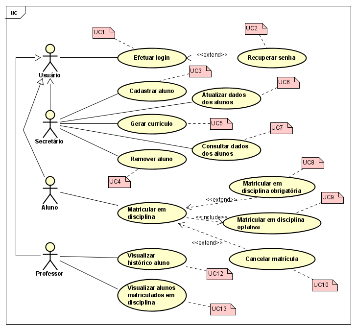

# LDS-Lab01

### Sistema de matrículas

O sistema de matrículas é uma ferramenta abrangente que não apenas facilita o processo de matrícula e administração para a universidade, mas também melhora a experiência de alunos e professores. Ele é projetado para ser seguro, confiável e fácil de usar, garantindo que todas as operações acadêmicas possam ser gerenciadas de forma eficiente e eficaz.

### Diagrama de Caso de Uso

### Histórias de Usuário
| **História de Usuário** | **Como**        | **Quero**                               | **Para**                                       |
|-------------------------|-----------------|-----------------------------------------|------------------------------------------------|
| UC1                     | Usuário         | Efetuar login                           | Acessar o sistema com segurança                |
| UC2                     | Usuário         | Recuperar minha senha                   | Obter acesso à minha conta se esquecer minha senha |
| UC3                     | Secretário      | Cadastrar aluno                         | Adicionar novos alunos ao sistema              |
| UC4                     | Secretário      | Remover aluno                           | Excluir registros de alunos que não estão mais na instituição |
| UC5                     | Secretário      | Gerar currículo                         | Preparar e disponibilizar o plano acadêmico para o semestre |
| UC6                     | Secretário      | Atualizar dados do aluno                | Manter informações atualizadas dos alunos      |
| UC7                     | Secretário      | Consultar dados do aluno                | Acessar informações detalhadas sobre os alunos |
| UC8                     | Aluno           | Matricular em disciplina obrigatória    | Cumprir os requisitos do meu curso             |
| UC9                     | Aluno           | Matricular em disciplina optativa       | Complementar minha formação acadêmica          |
| UC10                    | Aluno           | Cancelar matrícula                       | Ajustar meu plano de estudos                   |
| UC11                    | Aluno           | Inscrever para o semestre                |Receber cobrança relativa as disciplinas daquele semestre|
| UC12                    | Professor       | Visualizar histórico do aluno            | Entender o progresso acadêmico do aluno        |
| UC13                    | Professor       | Visualizar os alunos matriculados em cada disciplina | Planejar aulas e avaliações                  |
