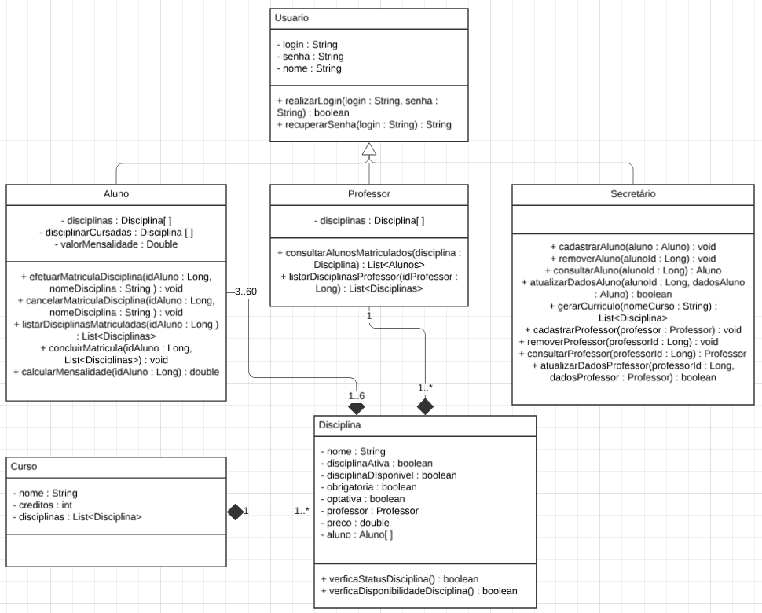

# LDS-Lab01

### Sistema de matrículas

O sistema de matrículas é uma ferramenta abrangente que não apenas facilita o processo de matrícula e administração para a universidade, mas também melhora a experiência de alunos e professores. Ele é projetado para ser seguro, confiável e fácil de usar, garantindo que todas as operações acadêmicas possam ser gerenciadas de forma eficiente e eficaz.

### Diagrama de Caso de Uso

### Diagrama de Classes

### Diagrama de Pacotes

### Histórias de Usuário

| **História de Usuário** | **Como**        | **Quero**                               | **Para**                                       |
|-------------------------|-----------------|-----------------------------------------|------------------------------------------------|
| UC1                     | Usuário         | Efetuar login                           | Acessar o sistema com segurança                |
| UC2                     | Usuário         | Recuperar senha                         | Conseguir acessar o sistema se esquecer minha senha |
| UC3                     | Secretário      | Cadastrar aluno                         | Inserir novos alunos no sistema                |
| UC4                     | Secretário      | Atualizar aluno                         | Manter os dados dos alunos sempre corretos e atualizados |
| UC5                     | Secretário      | Remover aluno                           | Excluir alunos que não fazem mais parte da instituição |
| UC6                     | Secretário      | Consultar aluno                         | Verificar dados e informações de alunos no sistema |
| UC7                     | Secretário      | Cadastrar professor                     | Inserir novos professores no sistema           |
| UC8                     | Secretário      | Atualizar professor                     | Manter os dados dos professores corretos e atualizados |
| UC9                     | Secretário      | Remover professor                       | Excluir professores que não fazem mais parte da instituição |
| UC10                    | Secretário      | Consultar professor                     | Verificar dados e informações de professores no sistema |
| UC11                    | Aluno           | Matricular em disciplina                | Me inscrever nas disciplinas de meu interesse   |
| UC12                    | Aluno           | Cancelar matrícula em disciplina        | Deixar de cursar uma disciplina que não desejo mais cursar |
| UC13                    | Aluno           | Efetuar matrícula no semestre           | Finalizar minha matrícula para o semestre |
| UC14                    | Aluno           | Gerar mensalidade                       | Receber o boleto referente a minha mensalidade|
| UC15                    | Aluno           | Listar disciplinas matriculadas         | Visualizar todas as disciplinas em que estou matriculado |
| UC16                    | Aluno           | Matricular em disciplina obrigatória    | Me inscrever em disciplinas essenciais para minha formação |
| UC17                    | Aluno           | Matricular em disciplina optativa       | Me inscrever em disciplinas que complementam minha formação |
| UC18                    | Professor       | Listar alunos de uma disciplina         | Visualizar os alunos que estão matriculados em minhas disciplinas |
| UC19                    | Professor       | Listar disciplinas lecionadas           | Verificar todas as disciplinas que estou ministrando |

